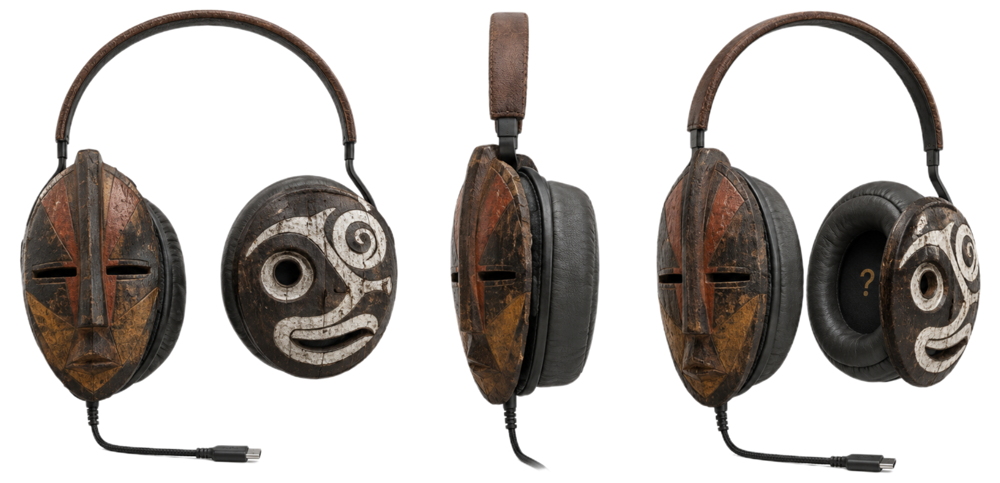

# Brief Codex · V0.10 · Expansión del catálogo + precios canónicos

**Para:** Codex CLI
**De:** Juan / Cowork Simio Plateado
**Fecha:** 2026-05-10+
**Status pre-requisito:** V0.9 ya deployada (titulos handwritten vivos en simioplateado.com). Si V0.9 todavía no está en producción, hacerla primero — V0.10 asume su existencia.

---

## Filosofía de esta versión

V0.10 hace **cinco cosas y solo cinco**:

1. Agrega **4 piezas escultóricas nuevas** al Drop 001 (TRAUMIN, SUPERHOMBRESITO, DIALOGUIN, MINI_DEVENIRES) con sus modales explosionados.
2. Crea una sección nueva **WEARABLES** (5 piezas: camiseta blanca, camiseta negra, gorra, PARCHAO, MELISIMO).
3. Crea una sección nueva **IMPOSIBLE** (3 audífonos en exhibición pura, sin precio, sin acción de voto).
4. Aplica **precios canónicos** a todas las piezas del catálogo (existentes + nuevas).
5. Distribuye **7 acentos flotantes** (`acento-01.png` a `acento-07.png`) en zonas específicas de la página.

Lo que **NO** se toca: el home, los ensayos, la sección Destrúyelo Todo, el about, el footer, el nav. Tampoco se toca el backend del sondeo (eso sigue en `BRIEF_CODEX_SONDEO.md`).

---

## Decisiones doctrinales ya cerradas (no cuestionar)

Estas decisiones vienen cerradas desde Cowork con Juan. Codex las aplica como están:

1. **Imágenes de producto**: la mayoría de piezas tienen ahora figurita hand-drawn dibujada por Juan y procesada en `assets/processed/piezas/`. Las que la tienen, usan esa imagen en el frame. Las que aún no la tienen (PARCHAO, AUDIO.OIMIS, camiseta blanca, camiseta negra, gorra) quedan con **placeholder**: el `<div class="frame">` muestra el nombre handwritten centrado en grande + el sello IRREAL o IMPOSIBLE según corresponda. Sin texto adicional. Sin "próximamente". El nombre + sello hacen el trabajo.

**Mapeo definitivo imagen ↔ pieza** (las ya existentes no cambian):

| Pieza                          | Imagen del frame                                         |
| ------------------------------ | -------------------------------------------------------- |
| TRAUMIN.v01                    | `assets/processed/piezas/traumin.png`                    |
| SUPERHOMBRESITO.v01            | `assets/processed/piezas/superhombresito.png`            |
| DIALOGUIN.v01                  | `assets/processed/piezas/dialoguin.png`                  |
| MINI_DEVENIRES.v01             | `assets/processed/piezas/mini-devenires.png`             |
| MELISIMO.v01                   | `assets/processed/piezas/melisimo.png`                   |
| PARCHAO.v01                    | `assets/processed/piezas/parchao.png`                    |
| Camiseta blanca                | `assets/processed/piezas/camiseta-blanca.png`            |
| Camiseta negra                 | `assets/processed/piezas/camiseta-negra.png`             |
| Gorra                          | `assets/processed/piezas/gorra.png`                      |
| AUDIO.ANTROPOS.v02             | `assets/processed/piezas/audifonos-tribu.png`            |
| AUDIO.NEO.v02                  | `assets/processed/piezas/audifonos-neo.png`              |
| AUDIO.OIMIS.v02                | `assets/processed/piezas/audifonos-simio.png`            |

**Todas las piezas del catálogo V0.10 tienen ahora imagen real de producto** — ninguna queda en placeholder.

2. **Orden de secciones nuevas**: `drop → wearables → imposible → ensayos → ensayo-destruyelo → about`. Wearables va inmediatamente después del Drop, IMPOSIBLE inmediatamente después de Wearables.

3. **Tier no visible**: NO etiquetar tier en pieza. Cero tags "Tier 4 · con pantalla". El precio + la imagen + el cualificador de edición ya hablan. Etiquetar tier rompería la doctrina.

4. **Sin sección KEMOPEV**: no agregar nada de ese proyecto en V0.10.

5. **Formato canónico del precio**: `USD 188 · edición pequeña` en una sola línea dentro de `.precio`. Para piezas sin cualificador de edición (camisetas, gorra), solo `USD 34`. Para IMPOSIBLE, solo `—` (raya em U+2014). Cero signo `$`. Cero centavos. Mayúsculas estrictas en `USD`.

---

## Tarea 1 · Agregar 4 piezas nuevas al Drop 001

### 1a · Tiles nuevos en el grid

En `<div class="pieza-grid">`, agregar 4 tiles nuevos. Estructura por tile (las 4 tienen imagen real de producto, NO placeholder):

```html
<div class="pieza pX irreal rX" onclick="abrirModal('SLUG')">
  <div class="frame">
    
    
  </div>
  <div class="meta">
    <div class="codigo">
      
      <span class="variante">.v01</span>
    </div>
    <div class="nota">IRREAL · sondeo silencioso</div>
    <div class="precio">USD XXX · edición pequeña</div>
  </div>
</div>
```

Datos exactos para cada uno:

| Slug              | onclick                          | imagen producto (frame)                                 | codigo-hand (meta)                                   | nombre alt          | precio                                |
| ----------------- | -------------------------------- | ------------------------------------------------------- | ---------------------------------------------------- | ------------------- | ------------------------------------- |
| `traumin`         | `abrirModal('traumin')`          | `assets/processed/piezas/traumin.png`                   | `assets/processed/textos/traumin.png`                | TRAUMIN             | `USD 84 · edición pequeña`            |
| `superhombresito` | `abrirModal('superhombresito')`  | `assets/processed/piezas/superhombresito.png`           | `assets/processed/textos/nietzschito.png`            | SUPERHOMBRESITO     | `USD 108 · edición pequeña`           |
| `dialoguin`       | `abrirModal('dialoguin')`        | `assets/processed/piezas/dialoguin.png`                 | `assets/processed/textos/dialoguin.png`              | DIALOGUIN           | `USD 132 · edición muy pequeña`       |
| `minidevenires`   | `abrirModal('minidevenires')`    | `assets/processed/piezas/mini-devenires.png`            | `assets/processed/textos/mini-devenires.png`         | MINI_DEVENIRES      | `USD 148 · edición pequeña`           |

**Nota SUPERHOMBRESITO**: el nombre handwritten procesado se llama `nietzschito.png` (no `superhombresito.png`) porque ese fue el slug interno con el que se procesó originalmente. La pieza canónica se llama SUPERHOMBRESITO.v01 — usar ese nombre en todo lo visible (alt, codigo-pieza, textos del modal). Solo el path al PNG del texto handwritten es `nietzschito.png`.

Las clases `pX` y `rX` siguen la convención del grid actual — usar `p10/r10`, `p11/r11`, `p12/r12`, `p13/r13` o continuar la secuencia que Codex vea en el HTML existente, manteniendo el ritmo asymétrico de tamaños.

### 1b · CSS para el placeholder

Agregar al `<style>`:

```css
/* Frame placeholder: pieza sin imagen de producto */
.frame .nombre-grande-placeholder {
  display: block;
  max-width: 78%;
  max-height: 60%;
  width: auto;
  height: auto;
  object-fit: contain;
}

/* Sello IRREAL como overlay del frame */
.frame .sello-irreal-overlay {
  position: absolute;
  top: 6%;
  right: 6%;
  width: 28%;
  height: auto;
  opacity: 0.85;
  transform: rotate(8deg);
  pointer-events: none;
}

@media (max-width: 720px) {
  .frame .sello-irreal-overlay { width: 32%; }
}
```

**Importante**: si el sello IRREAL como overlay ya existe en alguna forma del CSS (revisar V0.8/V0.9 — probablemente ya está aplicado a las piezas existentes), reutilizar la regla existente en lugar de duplicar. Si no existe, agregar la regla arriba.

### 1c · Modales explosionados de las 4 piezas nuevas

Replicar la estructura de los modales existentes (`#modal-tuni`, `#modal-marxito`, etc.) creando `#modal-traumin`, `#modal-superhombresito`, `#modal-dialoguin`, `#modal-minidevenires`. Cada modal sigue la misma plantilla pero con copy mínimo (sin párrafos descriptivos largos — Juan agregará copy canónico después).

Plantilla (las 4 piezas tienen imagen real de producto):

```html
<div class="modal-explosionado" id="modal-SLUG" onclick="cerrarSiClickFuera(event, 'SLUG')">
  <div class="modal-header">
    <button class="modal-cerrar" onclick="cerrarModal()">← Cerrar</button>
    <span class="codigo-pieza">CODIGO_TECNICO</span>
  </div>

  <div class="modal-body" onclick="event.stopPropagation()">
    <h3 class="exp-titulo">
      
    </h3>

    <div class="exp-meta-row">
      <div><strong>Estado</strong><br>IRREAL · sondeo silencioso</div>
      <div><strong>Precio proyectado</strong><br>USD XXX · edición pequeña</div>
    </div>

    <div class="exp-imagen">
      
      
    </div>

    <div class="exp-votar">
      <h4>Querer que exista</h4>
      <div class="votar-opcion">
        <h5>→ Avísame cuando exista</h5>
        <p>Un solo email cuando pase a producción.</p>
        <div class="form-row">
          <input type="email" placeholder="tu@email.com" id="email-input-SLUG">
          <button class="submit" onclick="votarEmail('panel-votar-SLUG','email-input-SLUG','votar-conf-SLUG','btn-votar-SLUG','NOMBRE')">Enviar →</button>
        </div>
      </div>
      <div class="votar-opcion">
        <h5>→ Solo quiero que exista</h5>
        <p>Anotamos tu voto en silencio.</p>
        <button class="silencio" onclick="votarSilencio('panel-votar-SLUG','votar-conf-SLUG','btn-votar-SLUG')">Anotar en silencio</button>
      </div>
    </div>

    <div id="votar-conf-SLUG" class="votar-conf"></div>
  </div>
</div>
```

Datos para los 4 modales:

| modal id              | slug en JS        | codigo-pieza         | texto hand (h3)                              | imagen producto                                          | precio                            |
| --------------------- | ----------------- | -------------------- | -------------------------------------------- | -------------------------------------------------------- | --------------------------------- |
| `modal-traumin`       | `traumin`         | `TRAUMIN.v01`        | `assets/processed/textos/traumin.png`        | `assets/processed/piezas/traumin.png`                    | `USD 84 · edición pequeña`        |
| `modal-superhombresito` | `superhombresito` | `SUPERHOMBRESITO.v01` | `assets/processed/textos/nietzschito.png`   | `assets/processed/piezas/superhombresito.png`            | `USD 108 · edición pequeña`       |
| `modal-dialoguin`     | `dialoguin`       | `DIALOGUIN.v01`      | `assets/processed/textos/dialoguin.png`      | `assets/processed/piezas/dialoguin.png`                  | `USD 132 · edición muy pequeña`   |
| `modal-minidevenires` | `minidevenires`   | `MINI_DEVENIRES.v01` | `assets/processed/textos/mini-devenires.png` | `assets/processed/piezas/mini-devenires.png`             | `USD 148 · edición pequeña`       |

El `.exp-imagen` necesita su propia regla CSS para verse bien dentro del modal:

```css
.exp-imagen {
  position: relative;
  width: 100%;
  max-width: 32rem;
  aspect-ratio: 4/5;
  margin: 2rem auto;
  border: 1px solid var(--ink);
  display: flex;
  align-items: center;
  justify-content: center;
  overflow: hidden;
}
.exp-imagen > img:not(.sello-irreal-overlay) {
  max-width: 86%;
  max-height: 86%;
  object-fit: contain;
}
.exp-imagen .sello-irreal-overlay {
  position: absolute;
  top: 6%;
  right: 6%;
  width: 24%;
  opacity: 0.85;
  transform: rotate(8deg);
}

/* Variante placeholder para piezas SIN imagen real de producto */
.exp-imagen-placeholder { /* mismas reglas que .exp-imagen */ }
.exp-imagen-placeholder .nombre-grande-placeholder {
  max-width: 70%;
  max-height: 55%;
}
```

---

## Tarea 2 · Sección WEARABLES

### 2a · Estructura HTML

Después de `</section>` del Drop, antes de la sección de ensayos, insertar:

```html
<section class="wearables">
  <div class="seccion-header">
    <h2 class="izq">Wearables</h2>
    <div class="centro">para llevarse puesto</div>
    <div class="der">IRREAL · sondeo</div>
  </div>

  <div class="seccion-leyenda">
    <p>Piezas de uso cotidiano dentro del universo Simio Plateado. Mismo principio que el Drop: si suficiente gente quiere que existan, existen.</p>
  </div>

  <div class="pieza-grid wearables-grid">
    <!-- 5 tiles -->
  </div>
</section>
```

CSS para la sección (replicar el estilo de `section.drop`):

```css
section.wearables {
  border-top: 1px solid var(--rule);
  padding: var(--aire-y) var(--aire-x);
}
section.wearables .seccion-header {
  display: grid;
  grid-template-columns: 1fr 1fr 1fr;
  align-items: baseline;
  margin-bottom: 4rem;
  font-size: 0.74rem;
  letter-spacing: 0.08em;
  text-transform: uppercase;
}
section.wearables .seccion-header .izq { text-align: left; }
section.wearables .seccion-header .centro { text-align: center; opacity: 0.55; }
section.wearables .seccion-header .der { text-align: right; opacity: 0.55; }
section.wearables .seccion-header h2 { font-size: inherit; letter-spacing: inherit; font-weight: 700; margin: 0; }
section.wearables .seccion-leyenda { max-width: 30rem; margin-bottom: 5rem; font-size: 0.92rem; line-height: 1.55; }
.wearables-grid { display: grid; grid-template-columns: repeat(12, 1fr); gap: 5rem 1.5rem; }
```

### 2b · 5 tiles de wearables

Mismo formato que las piezas del Drop. Todas en estado IRREAL · sondeo silencioso. **Algunas tienen imagen real, otras placeholder** — usar la columna "imagen frame" para cada caso.

| Slug              | onclick                          | imagen frame                                                  | codigo-hand (meta)                              | nombre alt        | precio                                | variante      |
| ----------------- | -------------------------------- | ------------------------------------------------------------- | ----------------------------------------------- | ----------------- | ------------------------------------- | ------------- |
| `camiseta-blanca` | `abrirModal('camiseta-blanca')`  | `assets/processed/piezas/camiseta-blanca.png` | `assets/processed/textos/camiseta-blanca.png`   | Camiseta blanca   | `USD 34`                              | (sin variante) |
| `camiseta-negra`  | `abrirModal('camiseta-negra')`   | `assets/processed/piezas/camiseta-negra.png`  | `assets/processed/textos/camiseta-negra.png`    | Camiseta negra    | `USD 38`                              | (sin variante) |
| `gorra`           | `abrirModal('gorra')`            | `assets/processed/piezas/gorra.png`           | `assets/processed/textos/gorra.png`             | Gorra             | `USD 44`                              | (sin variante) |
| `parchao`         | `abrirModal('parchao')`          | `assets/processed/piezas/parchao.png`         | `assets/processed/textos/parchao.png`           | PARCHAO           | `USD 138 · edición pequeña`           | `.v01`        |
| `melisimo`        | `abrirModal('melisimo')`         | `assets/processed/piezas/melisimo.png`        | `assets/processed/textos/melisimo.png`          | MELISIMO          | `USD 138 · edición pequeña`           | `.v01`        |

Para las wearables sin cualificador de edición (camisetas, gorra), la `.precio` muestra solo `USD 34` sin el ` · edición pequeña`. Las gafas sí llevan cualificador.

**Todas las wearables usan imagen real del producto** — ninguna queda en placeholder.

Spans del grid: 4 cols por pieza, 3 piezas por fila (fila 1: camiseta blanca, camiseta negra, gorra; fila 2: parchao, melisimo, vacío). Codex puede ajustar spans para crear ritmo asimétrico si lo ve coherente con el Drop.

### 2c · Modales de wearables

Cada wearable tiene su modal siguiendo la misma plantilla del modal de pieza nueva (Tarea 1c). Para camisetas y gorra, el `<div class="exp-meta-row">` no muestra cualificador de edición:

```html
<div class="exp-meta-row">
  <div><strong>Estado</strong><br>IRREAL · sondeo silencioso</div>
  <div><strong>Precio proyectado</strong><br>USD 34</div>
</div>
```

---

## Tarea 3 · Sección IMPOSIBLE

### 3a · Estructura HTML

Después de `</section>` de Wearables, antes de la sección de ensayos:

```html
<section class="imposible">
  <div class="seccion-header">
    <h2 class="izq">Imposible</h2>
    <div class="centro">exhibición pura</div>
    <div class="der">no a la venta</div>
  </div>

  <div class="seccion-leyenda">
    <p>Piezas que no son para fabricarse ni venderse. No tienen botón. No tienen sondeo. Son para mirarse y dejar pendientes — lo IRREAL llevado hasta su forma más radical.</p>
  </div>

  <div class="pieza-grid imposible-grid">
    <!-- 3 tiles de audífonos -->
  </div>
</section>
```

CSS análogo a wearables:

```css
section.imposible {
  border-top: 1px solid var(--rule);
  padding: var(--aire-y) var(--aire-x);
}
/* (header y leyenda comparten estilo con section.wearables — refactorizar si tiene sentido o duplicar) */
.imposible-grid { display: grid; grid-template-columns: repeat(12, 1fr); gap: 5rem 1.5rem; }

/* Tile IMPOSIBLE: sin cursor pointer, sin hover, sin click */
.pieza.imposible-tile { cursor: default; }
.pieza.imposible-tile:hover .frame { background: var(--paper); }

/* Sello IMPOSIBLE como overlay */
.frame .sello-imposible-overlay {
  position: absolute;
  top: 6%;
  right: 6%;
  width: 32%;
  height: auto;
  opacity: 0.9;
  transform: rotate(-6deg);
  pointer-events: none;
}
@media (max-width: 720px) {
  .frame .sello-imposible-overlay { width: 36%; }
}
```

### 3b · 3 tiles de audífonos IMPOSIBLE

Las tres tienen imagen real de producto. Mismo formato para las tres:

| Pieza             | imagen frame                                              | codigo-hand (meta)                              | alt código        | variante  | precio |
| ----------------- | --------------------------------------------------------- | ----------------------------------------------- | ----------------- | --------- | ------ |
| AUDIO.ANTROPOS    | `assets/processed/piezas/audifonos-tribu.png`             | `assets/processed/textos/audifonos-tribu.png`   | AUDIO.ANTROPOS    | `.v02`    | `—`    |
| AUDIO.NEO         | `assets/processed/piezas/audifonos-neo.png`               | `assets/processed/textos/audifonos-neo.png`     | AUDIO.NEO         | `.v02`    | `—`    |
| AUDIO.OIMIS       | `assets/processed/piezas/audifonos-simio.png`             | `assets/processed/textos/audifonos-simio.png`   | AUDIO.OIMIS       | `.v02`    | `—`    |

Estructura del tile:

```html
<div class="pieza imposible-tile">
  <div class="frame">
    
    
  </div>
  <div class="meta">
    <div class="codigo">
      
      <span class="variante">.v02</span>
    </div>
    <div class="nota">IMPOSIBLE · exhibición pura</div>
    <div class="precio">—</div>
  </div>
</div>
```

**Importante**: las 3 piezas IMPOSIBLE **NO tienen `onclick="abrirModal(...)"`** ni cursor pointer. Son contemplación pura. No abren modal, no permiten voto, no se interactúan. El sello IMPOSIBLE y la raya em en el precio hacen todo el trabajo curatorial.

---

## Tarea 4 · Aplicar precios canónicos al catálogo existente

Las 9 piezas que ya están en V0.9 actualmente no tienen precio (o tienen placeholder). Agregar/actualizar el `<div class="precio">` en cada `.meta` con los valores canónicos:

| Pieza existente            | precio                            |
| -------------------------- | --------------------------------- |
| TUNI.v01.ROSA              | `USD 188 · edición pequeña`       |
| TUNI.v01.BLANCA            | `USD 188 · edición pequeña`       |
| TUNI.v01.NEGRA             | `USD 188 · edición pequeña`       |
| COPA_CHISTE_COLOMBIA.v0    | `USD 64 · edición pequeña`        |
| MARXITO.v01                | `USD 108 · edición pequeña`       |
| PLANTI_PUNK.v01            | `USD 168 · edición pequeña`       |
| PLANTI_PUNK_XL.v01         | `USD 218 · edición muy pequeña`   |
| PLANTI_K.v01               | `USD 168 · edición pequeña`       |
| PLANTI_K_XL.v01            | `USD 218 · edición muy pequeña`   |

Si el `.meta` actual no tiene `.precio`, agregarla justo después de `.nota`. Si la tiene con valor distinto, sobreescribir.

CSS para `.precio` (revisar si ya existe en V0.9; si no, agregar):

```css
.pieza .meta .precio {
  margin-top: 0.3rem;
  font-variant-numeric: tabular-nums;
  font-size: 0.78rem;
  font-weight: 700;
  letter-spacing: 0.02em;
}
```

Y en los modales, el `<div class="exp-meta-row">` también muestra el precio proyectado en cada modal existente (no solo los nuevos):

| Modal existente | precio proyectado en exp-meta-row |
| --------------- | --------------------------------- |
| modal-tuni | `USD 188 · edición pequeña` |
| modal-copa | `USD 64 · edición pequeña` |
| modal-marxito | `USD 108 · edición pequeña` |
| modal-punk | `USD 168 · edición pequeña` |
| modal-punk-xl | `USD 218 · edición muy pequeña` |
| modal-k | `USD 168 · edición pequeña` |
| modal-k-xl | `USD 218 · edición muy pequeña` |

Si el `<div class="exp-meta-row">` no existe todavía en los modales actuales de V0.9, agregarlo justo después de `<h3 class="exp-titulo">` con el estado y el precio proyectado.

---

## Tarea 5 · Acentos flotantes

7 imágenes en `assets/processed/acentos/acento-01.png` a `acento-07.png`. Se distribuyen como gestos curatoriales — baja opacidad, posición absoluta, sin interferir con texto ni piezas.

### 5a · CSS base

```css
.acento-flotante {
  position: absolute;
  width: clamp(40px, 6vw, 80px);
  height: auto;
  opacity: 0.45;
  pointer-events: none;
  z-index: 1;
}

/* Posiciones específicas */
.acento-home-izq { top: 14%; left: 6%; transform: rotate(-12deg); }
.acento-home-der { bottom: 18%; right: 8%; transform: rotate(8deg); width: clamp(50px, 7vw, 90px); }
.acento-drop-der { top: 6%; right: 4%; transform: rotate(15deg); }
.acento-transicion { top: -3rem; left: 50%; transform: translateX(-50%) rotate(-5deg); width: clamp(45px, 6vw, 75px); }
.acento-imposible { top: 12%; left: 8%; transform: rotate(-8deg); }
.acento-about { top: 25%; right: 12%; transform: rotate(20deg); }
.acento-footer { bottom: 4%; left: 14%; transform: rotate(-15deg); }

@media (max-width: 720px) {
  .acento-flotante { opacity: 0.35; }
}
```

### 5b · Distribución sugerida

Insertar dentro del HTML así (Codex puede ajustar posiciones finas si visualmente algo choca):

```html
<!-- Dentro de section.home -->


<!-- Dentro de section.drop (al inicio, esquina sup-der) -->


<!-- Al inicio de section.wearables (centrado arriba, como separador visual) -->


<!-- Al inicio de section.imposible -->


<!-- Dentro de section.about -->


<!-- Cerca del footer -->

```

**Importante**: las secciones que reciben acentos necesitan `position: relative` para que el `position: absolute` del acento sea relativo a la sección. Si las secciones ya tienen `position: relative` en V0.9, no agregar nada. Si no, agregar:

```css
section.home, section.drop, section.wearables, section.imposible, section.about { position: relative; }
```

Los acentos **nunca** pueden quedar encima de:
- texto importante (frase ancla del home, copy de leyendas, copy del about, copy del manifiesto)
- imágenes de piezas dentro de los frames
- imágenes hand-drawn de títulos de sección

Codex revisa visualmente y ajusta posiciones si algún acento choca.

---

## Tarea 6 · Verificación + push

### 6a · Verificación visual

1. Local: abrir `index.html`.
2. **Drop 001**: confirmar 12 piezas en el grid (las 9 originales + TRAUMIN + DIALOGUIN + MINI_DEVENIRES). Cada una con su precio. Los 3 nuevos modales abren correctamente al click y muestran título handwritten, precio proyectado, y bloque de voto.
3. **Wearables**: nueva sección visible debajo del Drop. 5 tiles con placeholders + nombres handwritten + sellos IRREAL. Precios mostrados correctamente. Modales abren.
4. **Imposible**: nueva sección debajo de Wearables. 3 audífonos con placeholders + nombres handwritten + sello IMPOSIBLE. Precio `—`. **NO** abren modal al click. **NO** tienen cursor pointer.
5. **Acentos**: 7 acentos visibles en sus zonas, opacidad sutil, sin chocar con texto ni piezas.
6. **Mobile**: viewport ~375px, todo se ve bien, los acentos no se vuelven dominantes, las grid de wearables/imposible se apilan correctamente.
7. **Consola**: cero 404 por imágenes faltantes.

### 6b · Git push

```bash
git add -f assets/processed/textos/*.png assets/processed/acentos/*.png
git add -A
git commit -m "V0.10: piezas nuevas + Wearables + Imposible + precios canónicos + acentos flotantes"
git push origin main
```

Cloudflare Pages hace auto-deploy. Esperar ~1-2 minutos y verificar en `https://simioplateado.com`.

---

## Reportar a Juan al terminar

Mensaje con:
- ✅ confirmación de deploy
- ✅ confirmación de que los 12 tiles del Drop están visibles con precio
- ✅ confirmación de sección Wearables visible con 5 tiles
- ✅ confirmación de sección Imposible con 3 audífonos y sello correcto
- ✅ confirmación de 7 acentos distribuidos
- Cualquier rareza visual encontrada (acentos que chocaban, alturas de imagen que tocó ajustar, etc.)
- Si hubo que reordenar piezas del grid del Drop (algunas implementaciones eligen reorganizar por tier ascendente; Codex es libre de elegir orden curatorial siempre que mantenga el ritmo visual del grid actual)

---

## Si algo se rompe

- **Imagen no carga**: verificar que el path es correcto y el archivo está commiteado (`git ls-files | grep nombrearchivo`). Si no aparece, hacer `git add -f assets/processed/...`.
- **Acento choca con texto**: bajar opacity a 0.3, o desplazar posición, o reducir tamaño 20%.
- **Placeholder se ve mal en modal**: ajustar `max-width` y `max-height` del `.nombre-grande-placeholder` dentro del modal.
- **Sello IMPOSIBLE se ve mal**: el archivo `imposible.png` está en `assets/processed/textos/imposible.png` — verificar path. Rotación y tamaño se pueden ajustar en CSS sin tocar el archivo.
- **Modal IMPOSIBLE se abre por accidente**: revisar que las piezas `imposible-tile` no tengan `onclick` ni `cursor: pointer`.

Ante duda razonable, **detenerse y preguntar a Juan** antes de avanzar. Es preferible un push parcial bien hecho que un push completo dudoso.

---

## Lo que viene después de V0.10 (no en este brief)

- Backend del sondeo silencioso → `BRIEF_CODEX_SONDEO.md` (ya escrito, ejecutable cuando Juan diga).
- Imágenes de producto reales para piezas que hoy quedan en placeholder.
- Copy canónico para los modales de piezas nuevas y wearables (lo agrega Juan cuando tenga textos).
- DOCTRINA_VISUAL_SIMIO_PLATEADO.md (consolidar `doctrina/notas-tipograficas.md` + `doctrina/notas-precios.md` + decisiones visuales sueltas).

---

## Apéndices

### Apéndice A · Tabla maestra de precios del Drop 001 (escultórico)

```
COPA_CHISTE_COLOMBIA.v0           USD 64 · edición pequeña       (Tier 2)
TRAUMIN.v01                       USD 84 · edición pequeña       (Tier 2)
MARXITO.v01                       USD 108 · edición pequeña      (Tier 2)
SUPERHOMBRESITO.v01               USD 108 · edición pequeña      (Tier 2 · hermano de Marxito)
DIALOGUIN.v01                     USD 132 · edición muy pequeña  (Tier 2)
MINI_DEVENIRES.v01                USD 148 · edición pequeña      (Tier 2 · techo)
PLANTI_PUNK.v01 / PLANTI_K.v01    USD 168 · edición pequeña      (Tier 4)
TUNI.v01 (3 colores)              USD 188 · edición pequeña      (Tier 4)
PLANTI_PUNK_XL / PLANTI_K_XL      USD 218 · edición muy pequeña  (Tier 4 · techo)
```

### Apéndice B · Tabla maestra de precios Wearables

```
Camiseta blanca                   USD 34                         (Tier 1)
Camiseta negra                    USD 38                         (Tier 1)
Gorra                             USD 44                         (Tier 1)
PARCHAO.v01                       USD 138 · edición pequeña      (Tier 3)
MELISIMO.v01                      USD 138 · edición pequeña      (Tier 3)
```

### Apéndice C · Tabla IMPOSIBLE

```
AUDIO.ANTROPOS.v02                —                              (Tier 5 · exhibición)
AUDIO.NEO.v02                     —                              (Tier 5 · exhibición)
AUDIO.OIMIS.v02                   —                              (Tier 5 · exhibición)
```

### Apéndice D · Reglas tipográficas del precio (ya cerradas, no cuestionar)

- Prefijo `USD` siempre en mayúsculas, antes del número, separado por espacio.
- Número entero sin centavos.
- Cero signo `$`. Cero terminaciones `99` o `95`. Cero números redondos corporativos.
- Cualificador de edición separado por punto medio: ` · edición pequeña` o ` · edición muy pequeña`.
- Wearables sin cualificador de edición (camisetas, gorra): solo `USD 34`.
- IMPOSIBLE: solo `—` (raya em, U+2014).

---

Toda la doctrina referenciada está en `doctrina/notas-precios.md` y `doctrina/notas-tipograficas.md` dentro del repo. Codex puede consultarlas para entender el porqué detrás de cualquier decisión específica.
